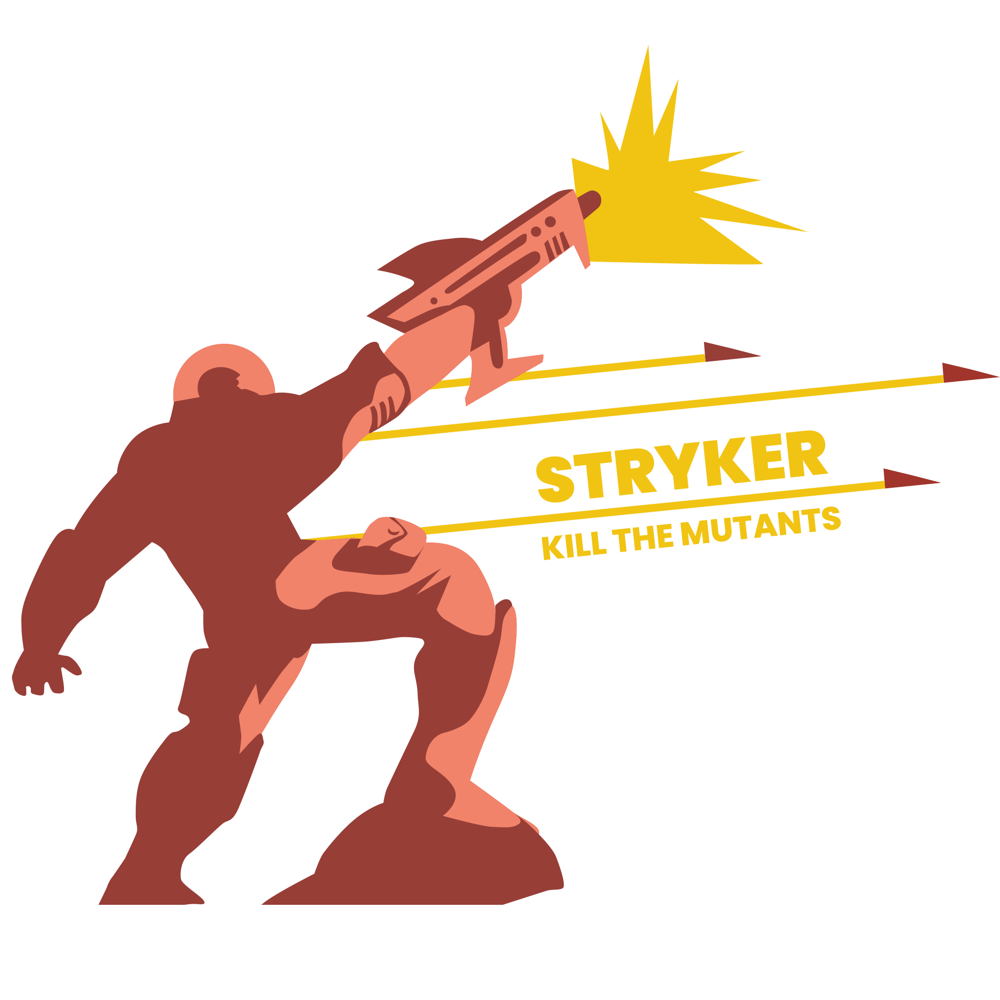

# Mutation Testing
Rage against the machine.

---
hideInToc: true
---

# Agenda

<Toc />
---
layout: quote
hideInToc: true
---

## First, some (possibly) controversial opinions

---
layout: quote
hideInToc: true
---

## 1. Writing tests is easy
<br>

<v-clicks every="2">

## 2. Knowing what to test is hard
<br>

## 3. Preventing regressions is even harder
<br>

## 4. Code coverage is a bad metric for test quality

</v-clicks>


---

# Introducing Mutation Testing


- What if we could test our tests?

<v-clicks>

- Mutation testing evaluates the quality of your test suite
- Try to break your code and see if your tests catch it
  - If your tests fail, they cover the mutation
  - If your tests pass, add more tests 

</v-clicks>


---
src: ./pages/mutation-example.md
---

---
hideInToc: true
---

<br><br><br><br> 

## Manual Mutation Testing is tedious

<br>

## We can do better!

{width=350 position=absolute right=20 bottom=20}

---

# Introduction to Stryker


- Open-source mutation testing tool

<v-clicks>

- Runs using your existing test suite
- Supports multiple languages
  - JavaScript / TypeScript
  - C# / .NET
  - Scala
- Can integrate into CI/CD pipelines
  - Set thresholds for when to fail the build

</v-clicks>

{width=450 position=absolute right=5 bottom=30}

---

# What does Stryker do?

1. Reads your code
1. Decides possible mutations

<v-clicks every="2">

3. Applies mutations
1. Runs your tests
1. Checks if tests fail
1. Reports results

</v-clicks>

TODO: Add screenshot of report

---

# Mutation Types

<v-clicks every="2">

| **Mutation Type** | **Description** |
| --- | --- |
| Equality Operator Replacement | Swap `==`, `!=`, `>`, `<`, `>=`, `<=` |
| Arithmetic Operator Replacement | Swap `+`, `-`, `*`, `/`, `%` |
| Logical Operator Replacement | Swap `!`, `&&`, `\|\|`, `and`, `is`, `is not`, `or` |
| Boolean Literal Replacement | Swap `true` & `false`, replace `cond` with `!cond` |
| Assignment Operator Replacement | Swap `=`, `+=`, `-=`, `*=`, `/=`, `%=` |
| Initialization Mutators | Replace initializers like `[1, 2, 3]` with `[]` |
| Removal Mutators | Remove statements and blocks (`return`, `break`, `throw`) |

</v-clicks>
---
src: ./pages/possible-mutations.md
---

---

# Live Demo 
You can try this at home!

Clone the example repo (or just download the code)

```sh
git clone https://github.com/wvanlit/mutation-testing-with-stryker.git
```

TypeScript

```sh
# Install dependencies
npm install

# Run mutation testing
npm run test:mutation
```

C#

```sh
# Install dependencies
dotnet restore

# Run mutation testing
dotnet stryker
```